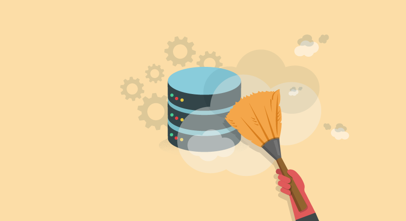

---
title: "Analysis of Formula 1 Data"
author: Abhiram Gunti
date: "04/12/2024"
output: ioslides_presentation
---

```{r setup, include=FALSE}
knitr::opts_chunk$set(echo = TRUE)
```

## Table of Contents

1. Data Analytics and Visualization
    - What is it?
    - Why is it important?
2. Intro to Formula 1
    - Important concepts about the sport
3. Data Analysis Process
    - Data Collection
    - Data Cleaning
    - Data Analysis
    - Data Visualization


## Data Analytics and Visualization

### What is it?
- Raw data --> useful information
- Clean up messy data
- Discover patterns and insights by representing the data in different ways

### Why is it important?

- Proper data analytics can help improve decision making, show hidden trends, and help in forecasting
- In sports, improves team/individual performance, helps in scouting, etc.

## Data Analytics and Visualization (cont)

### Common Tools
- Common tools: R and Python
- Common libraries: Pandas and Matplotlib

<center>


</center>

## Intro to Formula 1
<center>


</center>
<br>

- Formula 1 is the premiere open-wheel motorsport racing series
- Top 20 drivers in the world compete in ~23 races a year to win the World Drivers Championship title
- 10 teams (2 drivers per team) compete to win the World Constructors Championship title

## Basics and Terminology

- Each race is 300km (~50-70 laps depending on circuit)
- Qualifiying on Saturday sets grid order for Sunday race
- Each team has to adjust their setup and determine a race strategy every race
- Grid, pole position, pit stop, strategy

<center>


</center>

## Data in F1

- Macro scale: analyse evolution of sport, performance of teams over their history
    - Team win history, top speed of cars over time, etc.
- Per team scale: analyze car performance at each race to tune setup and race strategy
    - Downforce, tire temperature, fuel consumption, etc.

<center>


</center>

- Data helps improve car performance from practice to race, and from year to year

## Data Analysis Process

<center>


</center>
<br>

- Data collection, Data cleaning, Data analysis, Data visualization


## Data Collection

- First Party Data: data collected by you or the organization itself
    - Social media followers, feedback forms, sensor data, etc.
- Second Party Data: data collected not directly by you
    - Trusted partners, web scraping, etc.
- Third Party Data: data collected from external sources
    - Kaggle, Unaffiliated companies, etc.
- Dataset: Formula 1 World Championship (1950-2023)


## Data Cleaning

- Once the data is collected, it needs to be cleaned
- Involves removing any errors, inconsistencies, or duplicates in the data
- It might also make sense to restructure the data as you see fit

<br>

<center>



</center>

## Data Analysis

<center>


</center>

- Explore the data, play around with it
- Using your intuition, place different data together and graph them
- Use statistical methods to discover patterns and trends in the data


## Data Visualization

- Final step of the data analytics process is data visualization
- Involves presenting the data in a visual format to make it easier to understand
- Tell a story with your graphs and visualizations

<br>

<center>


</center>


## Resources

- https://www.kaggle.com/datasets/rohanrao/formula-1-world-championship-1950-2020
- https://towardsdatascience.com/a-beginners-guide-to-the-data-science-pipeline-a4904b2d8ad3
- https://www.simplilearn.com/tutorials/data-analytics-tutorial/what-is-data-analytics
- https://blog.hubspot.com/service/first-party-data